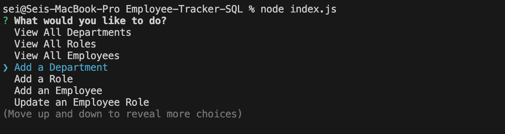

# Employee-Tracker-SQL

[]

## Description

This app helps you to manage your company database.

## Table of Contents

- [Installation](#installation)
- [Usage](#usage)
- [License](#license)
- [Contributing](#contributing)
- [Questions](#questions)

## Installation

Clone this repository:          
    
    git clone https://github.com/Sei-cloud/Employee-Tracker-SQL.git
    

## Usage

1. Make sure Node.js is installed on your machine. 
2. Install dependencies
    ```bash
    npm install
3. Navigate to the project directory:
    ```bash
    cd Employee-Tracker-SQL
4. Run the app
    ```bash
    node index.js
5. Prompt sample

    

6. If you're still struggling watch the video tutorial [here](https://vimeo.com/950372769?share=copy).

## License

This project is licensed under the [MIT License](https://opensource.org/licenses/MIT).

## Contributing

Others can contribute to this project via Github.


## Questions

For questions about the project, please feel free to contact [Sei-Cloud](https://github.com/Sei-Cloud) or [Email me](mailto:rocketsei.009@gmail.com).

